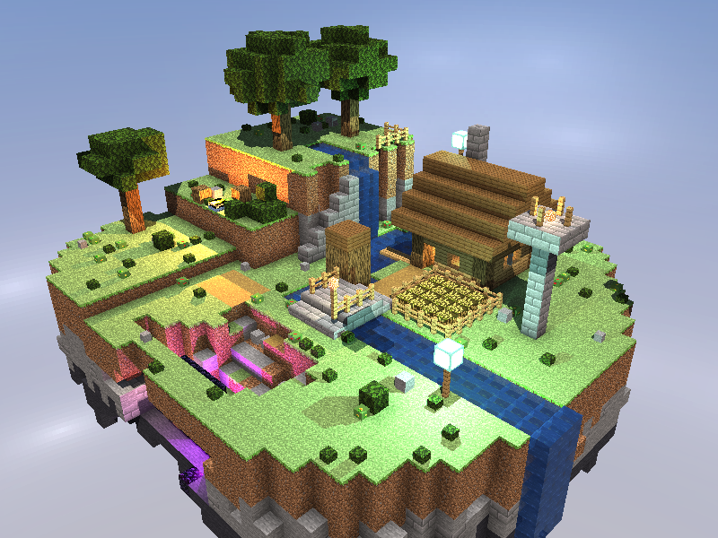
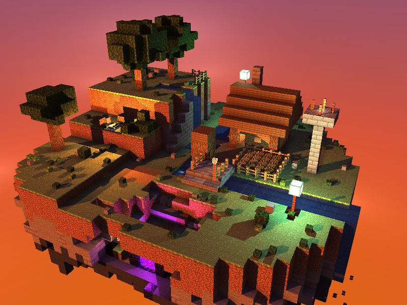
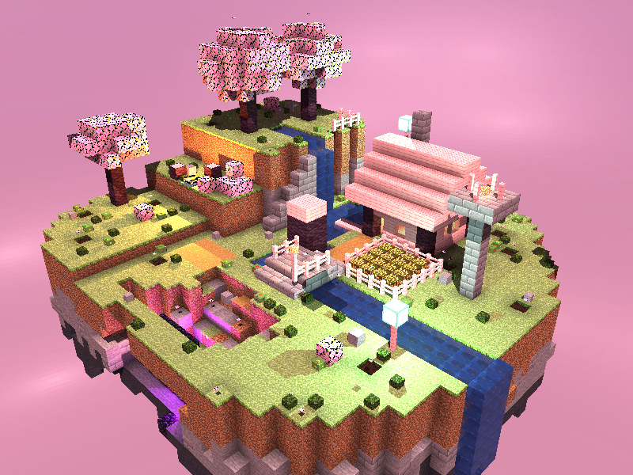
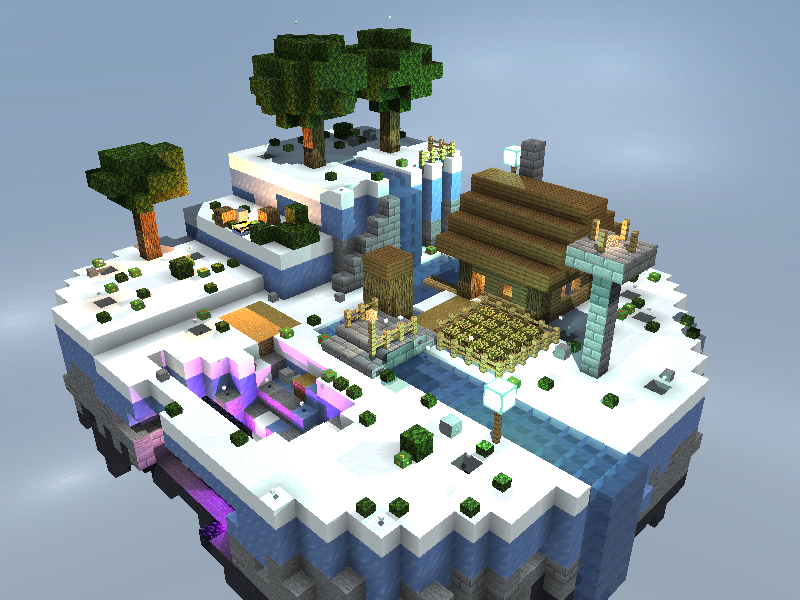
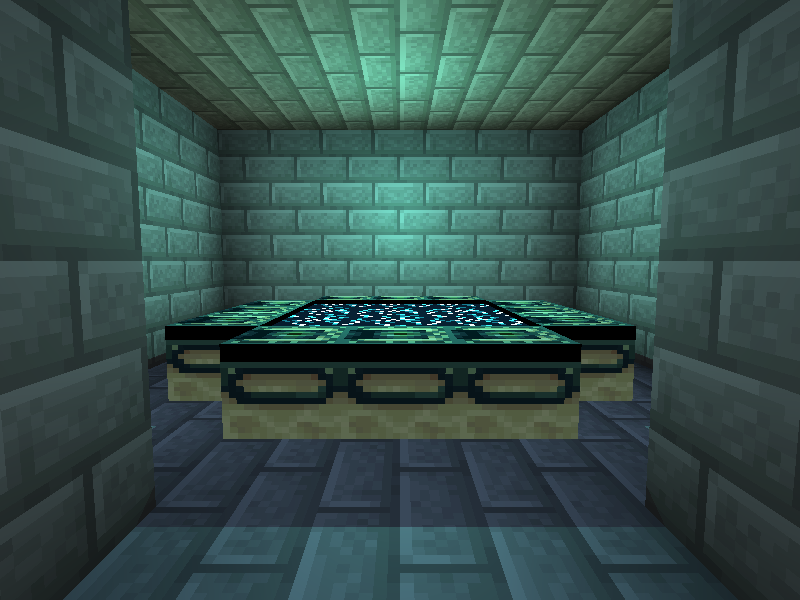
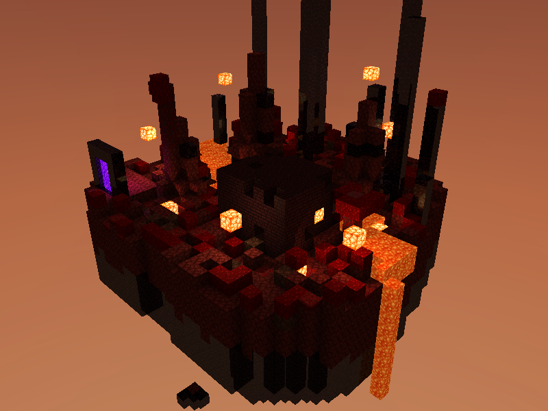
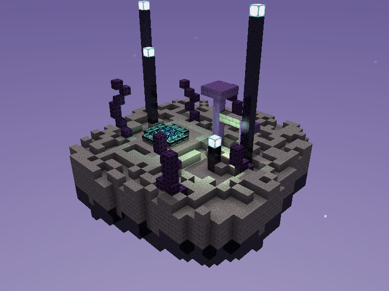

# Diorama con Raytracing

Proyecto 2 de Gráficas por Computadora (CC2018, UVG). Un diorama de isla flotante estilo Minecraft renderizado con un raytracer por CPU escrito desde cero en Rust.

Solo usa las dos dependencias del curso: `minifb` para la ventana y `nalgebra-glm` para los vectores. Las intersecciones, la iluminación, las sombras, los reflejos, la refracción, el skybox y hasta la lectura de las texturas están implementados a mano.



## Video

[Ver el video de demostración en YouTube](https://youtu.be/IWEjTmwfZ6A)

## Cómo ejecutarlo

Requiere [Rust](https://www.rust-lang.org/tools/install).

```bash
git clone git@github.com:her24770/graficas-Raytracing.git
cd graficas-Raytracing
cargo run --release
```

Hay que ejecutarlo desde la raíz del repositorio, porque las texturas se cargan de `assets/textures/`. Conviene usar siempre `--release`: el render corre por CPU.

## Controles

### Cámara orbital (modo inicial)

| Tecla | Acción |
|---|---|
| Flechas | Rotar alrededor del diorama |
| `+` / `-` | Acercar y alejar (zoom) |
| `Tab` | Cambiar a la cámara libre |

### Cámara libre

| Tecla | Acción |
|---|---|
| `W` `A` `S` `D` | Avanzar, retroceder y moverse de costado |
| Flechas | Mirar hacia los lados, arriba y abajo |
| `Espacio` / `Shift` izquierdo | Subir y bajar volando |
| `G` | Alternar entre volar y caminar con gravedad (`Espacio` salta) |
| `Tab` | Volver a la cámara orbital |

La cámara libre choca contra los bloques sólidos y atraviesa el agua, las plantas y los portales. Al tocar un portal se viaja al otro mundo.

### Escenas y hora del día

| Tecla | Acción |
|---|---|
| `1` a `6` | Biomas de la isla: Overworld, Marino, Nieve, Desierto, Mesa y Sakura |
| `7` | Nether |
| `8` | End |
| `T` | Pausar o reanudar el ciclo de día y noche |
| `V` | Velocidad del tiempo: normal, rápido y muy rápido |
| `,` / `.` | Atrasar y adelantar la hora |
| `M` | Encender o apagar la música |
| `Esc` | Salir |

## Qué tiene el diorama

- **Isla flotante** de más de 4000 cubos: casa, torre, puente, río con cascada, cultivo, árboles, fogata, cueva con portal y rocas cayendo por debajo.
- **Seis biomas** que cambian texturas, iluminación y cielo sobre la misma isla.
- **Nether y End** como escenas propias, con su terreno, sus luces y su cielo.
- **Portales que funcionan**: el de la cueva lleva al Nether y cada mundo tiene su portal de regreso.
- **Sala oculta**: el portal al End está dentro de la roca. Solo se llega por un túnel que se abre en la pared oeste de la isla, bajo el acantilado.
- **Ciclo de día y noche** con sol, atardecer y luces que se notan al oscurecer.

| Atardecer | Sakura |
|---|---|
|  |  |

| Nieve | Sala oculta del End |
|---|---|
|  |  |

| Nether | End |
|---|---|
|  |  |

## Rúbrica

| Criterio | Cómo se cumple |
|---|---|
| Complejidad de la escena | Isla con construcciones, agua, vegetación y cueva; seis biomas, dos dimensiones extra y una sala oculta. |
| Atractivo visual | Ciclo de día y noche, luces puntuales de colores, oclusión ambiental y agua animada. |
| Cámara interactiva | Rotación orbital con las flechas y zoom con `+` / `-`. Además, cámara libre con colisión. |
| Materiales | Más de cinco materiales, cada uno con su textura y sus valores de albedo, specular, transparencia y reflectividad (ver tabla). |
| Refracción | Agua (índice 1.33) y vidrio (índice 1.5), con ley de Snell, reflexión interna total y Fresnel. |
| Reflexión | Agua, vidrio, obsidiana y portal, con rayos recursivos de hasta 3 rebotes. |
| Skybox | Textura de cielo equirectangular por mundo (Overworld, Nether y End) que envuelve la escena y aparece en reflejos y refracciones. |

### Materiales principales

| Material | Textura | Specular | Reflectividad | Transparencia | Índice de refracción |
|---|---|:---:|:---:|:---:|:---:|
| Pasto y tierra | `grass_block_top`, `dirt` | 0.03 – 0.05 | 0 | 0 | — |
| Piedra | `stone`, `stone_bricks` | 0.12 | 0 | 0 | — |
| Madera | `oak_log`, `oak_planks` | 0.08 | 0 | 0 | — |
| Agua | `water_still` (animada) | 0.9 | 0.3 | 0.6 | 1.33 |
| Vidrio | `glass` | 0.8 | 0.05 | 0.9 | 1.5 |
| Obsidiana | `obsidian` | 0.6 | 0.1 | 0 | — |
| Portal | `nether_portal` (emite luz) | 0.2 | 0.1 | 0.3 | — |
| Lámparas | `sea_lantern`, `glowstone` (emiten luz) | 0 | 0 | 0 | — |

## Cómo está hecho

- **Intersección rayo-cubo** con el método de slabs (AABB), con normal y coordenadas UV por cara.
- **Iluminación Phong** con varias luces, sombras, luz ambiente hemisférica y oclusión ambiental por esquina.
- **Reflexión y refracción** recursivas.
- **Aceleración**: grilla uniforme recorrida con el algoritmo de Amanatides-Woo, render repartido en hilos con `std::thread` y descarte de los cubos enterrados.
- **Texturas**: decodificador propio de BMP de 24 bits. Las texturas vienen de [misode/mcmeta](https://github.com/misode/mcmeta/tree/assets/assets/minecraft/textures/block).
- **Cámara libre**: colisión de caja contra los cubos eje por eje, gravedad y salto.
- **Música**: sin librerías de audio; el programa lanza `afplay`, el reproductor que trae macOS, como proceso aparte. En otros sistemas corre igual, pero en silencio.

### Archivos

| Archivo | Contenido |
|---|---|
| `src/main.rs` | Bucle principal, controles y trazado de rayos (iluminación, reflejos, refracción, skybox) |
| `src/scene.rs` | Escena, grilla de aceleración, colisión y portales |
| `src/cube.rs` | Intersección rayo-cubo |
| `src/ray_intersect.rs` | Materiales y datos de la intersección |
| `src/diorama.rs` | Construcción de la isla y sus biomas |
| `src/nether.rs`, `src/end.rs` | Construcción del Nether y del End |
| `src/daycycle.rs` | Ciclo de día y noche |
| `src/camera.rs`, `src/player.rs` | Cámara orbital y cámara libre |
| `src/texture.rs`, `src/framebuffer.rs` | Lectura de texturas y buffer de imagen |
| `src/light.rs`, `src/color.rs` | Luces y colores |
| `src/audio.rs` | Música de fondo |

## Pruebas y capturas

```bash
# Pruebas de la cámara libre y los portales
cargo test --release

# Guardar una captura sin abrir la ventana
# argumentos: archivo, giro en pasos, hora (0 a 1), escena (0-5 biomas, 6 Nether, 7 End)
cargo run --release -- --screenshot captura.bmp 0 0.4 0
```
